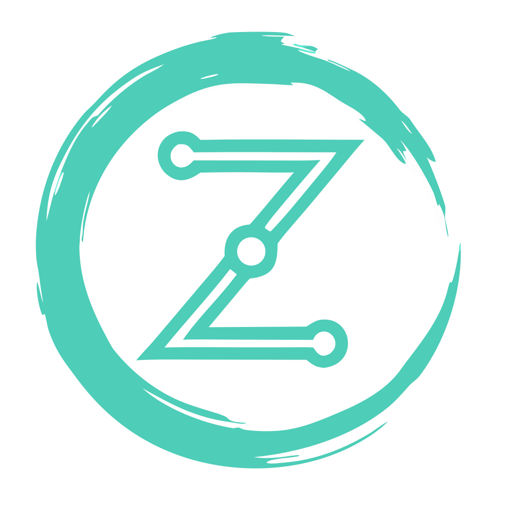
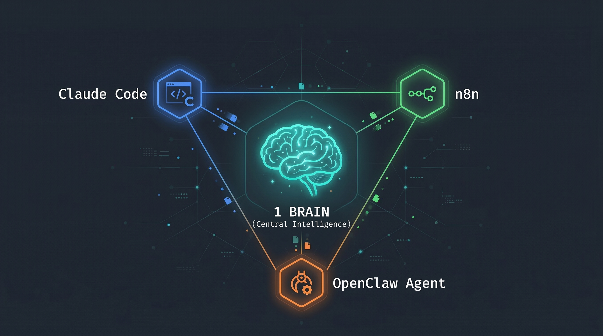

<p align="center">
  
  <h1 align="center">Multi-Agent Memory</h1>
  <p align="center">
    Cross-machine, cross-agent persistent memory for AI systems
  </p>
  <p align="center">
    <a href="#quick-start">Quick Start</a> &bull;
    <a href="#features">Features</a> &bull;
    <a href="#api-reference">API</a> &bull;
    <a href="#adapters">Adapters</a> &bull;
    <a href="#configuration">Config</a> &bull;
    <a href="#roadmap">Roadmap</a>
  </p>
  <p align="center">
    <a href="https://www.npmjs.com/package/@zensystemai/multi-agent-memory-mcp"></a>
    
    
    
    
  </p>
  <p align="center">
    
  </p>
</p>

---

**Multi-Agent Memory** gives your AI agents a shared brain that works across machines, tools, and frameworks. Store a fact from Claude Code on your laptop, recall it from an OpenClaw agent on your server, and get a briefing from n8n — all through the same memory system.

Born from a production setup where [OpenClaw](https://github.com/openclaw/openclaw) agents, Claude Code, and n8n workflows needed to share memory across separate machines. Nothing existed that did this well, so we built it.

### Latest: v2.4

- **`brain_reflect`** — On-demand LLM synthesis. Ask "what do we know about X?" and get patterns, timeline, contradictions, and knowledge gaps across your stored memories.
- **`brain_update`** — Amend existing memories in-place without full supersede. Content changes re-embed, re-extract entities, and re-index automatically.
- **Temporal Validity** — Facts and statuses now support `valid_from`/`valid_to` timestamps. Query "what was true at time X?" via the new `at_time` parameter on `brain_search`.
- **Pagination fixes** — Consolidation and briefings now process all memories, not just the first page.
- **114 tests passing** across RRF, entity extraction, validation, scrubbing, notifications, and client resolver.

See [CHANGELOG.md](CHANGELOG.md) for the full release history including v2.3 (multi-path RRF search), v2.2 (noise-free entity extraction, per-client knowledge base), and earlier versions.

<p align="center">
  
  
</p>
<p align="center">
  
  
</p>

## The Problem

You run multiple AI agents — Claude Code for development, OpenClaw for autonomous tasks, n8n for automation. They each maintain their own context and forget everything between sessions. When one agent discovers something important, the others never learn about it.

Existing solutions are either single-machine only, require paid cloud services, or treat memory as a flat key-value store without understanding that a *fact* and an *event* are fundamentally different things.

## Quick Start

```bash
# 1. Clone the repo
git clone https://github.com/ZenSystemAI/multi-agent-memory.git
cd multi-agent-memory

# 2. Configure
cp .env.example .env
# Edit .env — set BRAIN_API_KEY and QDRANT_API_KEY
# For embeddings: GEMINI_API_KEY (free tier) or OPENAI_API_KEY

# 3. Start services
docker compose up -d

# 4. Verify
curl http://localhost:8084/health
# {"status":"ok","service":"shared-brain","timestamp":"..."}

# 5. Store your first memory
curl -X POST http://localhost:8084/memory \
  -H "Content-Type: application/json" \
  -H "X-Api-Key: YOUR_KEY" \
  -d '{
    "type": "fact",
    "content": "The API uses port 8084 by default",
    "source_agent": "my-agent",
    "key": "api-default-port"
  }'
```

## Features

### Typed Memory with Mutation Semantics

Not all memories are equal. Multi-Agent Memory understands four distinct types, each with its own lifecycle:

| Type | Behavior | Use Case |
|------|----------|----------|
| **event** | Append-only. Immutable historical record. | "Deployment completed", "Workflow failed" |
| **fact** | Upsert by `key`. New facts supersede old ones. | "API status: healthy", "Client prefers dark mode" |
| **status** | Update-in-place by `subject`. Latest wins. | "build-pipeline: passing", "migration: in-progress" |
| **decision** | Append-only. Records choices and reasoning. | "Chose Postgres over MySQL because..." |

### Memory Lifecycle

```
Store ──> Dedup Check ──> Supersedes Chain ──> Confidence Decay ──> LLM Consolidation
  │            │                 │                    │                     │
  │     Exact match?      Same key/subject?    Score drops over      Groups, merges,
  │     Return existing   Mark old inactive    time without access   finds insights
  │                                                                        │
  └────────────────────────── Vector + Structured DB ──────────────────────┘
```

**Deduplication** — Content is SHA-256 hashed on storage. Exact duplicates are caught and return the existing memory. The consolidation engine also catches near-duplicates at 92% semantic similarity.

**Supersedes** — When you store a fact with the same `key` as an existing fact, the old one is marked inactive and the new one links back to it. Same pattern for statuses by `subject`. Old versions remain searchable but rank lower.

**Confidence Decay** — Facts and statuses lose confidence over time if not accessed (configurable, default 2%/day). Events and decisions don't decay — they're historical records. Accessing a memory resets its decay clock. Search results are ranked by `similarity * confidence`.

**LLM Consolidation** — A periodic background process (configurable, default every 6 hours) analyzes unconsolidated memories via LLM to find duplicates to merge, contradictions to flag, connections between memories, cross-memory insights, and named entities to extract and normalize.

### Entity Extraction & Linking

Every memory automatically extracts named entities at storage time — clients, technologies, workflows, people, domains, and agents. Two extraction paths compound over time:

- **Fast path (every write)** — Regex + known-tech dictionary + alias cache lookup. Sub-millisecond, no LLM call, non-blocking. Always extracts `client_id` and `source_agent` as entities. Catches technology names (70+ built-in), domain names, quoted references, and capitalized proper nouns. v2.2 adds aggressive noise filtering: rejects CSS properties, HTML attributes, camelCase/snake_case code identifiers, shell commands, error codes, sentence fragments, and generic adjective+noun phrases.
- **Smart path (every consolidation)** — The LLM discovers entities regex missed, normalizes aliases (so "acme-corp", "ACME", and "Acme Corporation" resolve to one canonical entity), and classifies types. Discovered aliases feed back into the fast-path alias cache — extraction gets smarter over time.

Entities are stored in three structured DB tables (SQLite/Postgres): canonical entities, aliases, and memory links. Each Qdrant memory payload is enriched with an `entities` array, indexed for native vector-filtered search — `GET /memory/search?entity=Docker` filters at the Qdrant level with no result-count ceiling.

Query the entity graph via `GET /entities`, filter search by entity, or use the `brain_entities` MCP tool.

### Credential Scrubbing

All content is scrubbed before storage. API keys, JWTs, SSH private keys, passwords, and base64-encoded secrets are automatically redacted. Agents can freely share context without accidentally leaking credentials into long-term memory.

### Agent Isolation

The API acts as a gatekeeper between your agents and the data. No agent — whether it's an OpenClaw agent, Claude Code, or a rogue script — has direct access to Qdrant or the database. They can only do what the API allows:

- **Store** and **search** memories (through validated endpoints)
- **Read** briefings, stats, and entities

They **cannot**:
- Delete memories or drop tables
- Bypass credential scrubbing
- Access the filesystem or database directly
- Modify other agents' memories retroactively

This is by design. Autonomous agents like OpenClaw run unattended on separate machines. If one hallucinates or goes off-script, the worst it can do is store bad data — it can't destroy good data.

### Security

- **Timing-safe authentication** — API key comparison uses `crypto.timingSafeEqual()` to prevent timing attacks
- **Rate limiting** — Failed authentication attempts are rate-limited per IP (10 failures/minute before lockout)
- **Startup validation** — The API refuses to start without required environment variables configured
- **Credential scrubbing** — All stored content is scrubbed for API keys, tokens, passwords, and secrets before storage

### Session Briefings

Start every session by asking "what happened since I was last here?" The briefing endpoint returns categorized updates from all other agents, excluding the requesting agent's own entries. Includes an `entities_mentioned` summary showing which entities appeared in the period.

```bash
curl "http://localhost:8084/briefing?since=2025-01-01T00:00:00Z&agent=claude-code" \
  -H "X-Api-Key: YOUR_KEY"
```

### Dual Storage

Every memory is stored in two places:
- **Qdrant** (vector database) — for semantic search, similarity matching, confidence scoring, and entity-filtered search via indexed payload
- **Structured database** — for exact queries, filtering, structured lookups, and entity graph storage

This means you get both "find memories similar to X" *and* "give me all facts with key Y" *and* "show me everything about entity Z" in the same system.

### How It Compares

| Feature | Multi-Agent Memory | [Mem0](https://github.com/mem0ai/mem0) | [Letta (MemGPT)](https://github.com/letta-ai/letta) | [Zep/Graphiti](https://github.com/getzep/graphiti) | [Hindsight](https://github.com/cyanheads/hindsight-core) |
|---------|:-:|:-:|:-:|:-:|:-:|
| Cross-machine by design | **Yes** | Cloud only | No | Cloud only | No |
| Typed memory (event/fact/status/decision) | **Yes** | No | No | No | No |
| Temporal validity (valid_from/valid_to) | **Yes** | No | No | **Yes** | No |
| Entity extraction + linking | **Yes** | Graph (Pro) | No | **Yes** | No |
| Multi-path search (vector+BM25+graph) | **Yes** | Vector only | Vector only | Hybrid | **Yes** |
| RRF fusion | **Yes** | No | No | No | **Yes** |
| LLM consolidation (scheduled) | **Yes** | Inline | Self-managed | No | Reflect |
| On-demand reflection/synthesis | **Yes** | No | No | No | **Yes** |
| Memory decay / confidence scoring | **Yes** | No | No | No | Partial |
| Content deduplication | **Hash + semantic** | LLM-based | Agent-managed | Entity resolution | Hash |
| Cross-agent corroboration | **Yes** | No | No | No | No |
| Credential scrubbing | **Yes** | No | No | No | No |
| Session briefings | **Yes** | No | No | No | No |
| Pluggable embeddings | OpenAI, Gemini, Ollama | Multiple | Multiple | Multiple | Ollama |
| Pluggable storage | SQLite, Postgres, Baserow | Multiple vector DBs | Postgres | Neo4j, FalkorDB | Postgres |
| MCP server | **Yes** | Community | No | No | **Yes** |
| Self-hostable (fully open) | **Yes** | Community ed. | **Yes** | Graphiti only | **Yes** |
| License | MIT | Apache 2.0 | Apache 2.0 | Open core | MIT |

## Architecture

```
┌───────────────────────────────────────────────────────────────────────────┐
│                            Your AI Agents                                 │
├──────────┬──────────┬──────────┬──────────┬──────────┬────────────────────┤
│Claude    │ Cursor   │ OpenClaw │ n8n      │ Bash     │ Any HTTP client    │
│Code      │          │ Agents   │ Webhooks │ Scripts  │                    │
│(MCP)     │ (MCP)    │ (Skill)  │          │ (CLI)    │                    │
└────┬─────┴────┬─────┴────┬─────┴────┬─────┴────┬─────┴──────────┬────────┘
     │          │          │          │          │                │
     ▼          ▼          ▼          ▼          ▼                ▼
┌───────────────────────────────────────────────────────────────────────────┐
│                        Memory API (Express)                               │
│  POST /memory  GET /memory/search  GET /briefing  GET /stats              │
│  GET /memory/query  POST /webhook/n8n  POST /consolidate  GET /entities   │
│  GET /client/:name  GET /export  POST /import  GET /graph                 │
├──────────────────────┬────────────────────────────────────────────────────┤
│   Embedding Layer    │            LLM Layer                               │
│  ┌────────┐ ┌──────┐ ┌──────┐│  ┌────────┐ ┌───────────┐ ┌──────┐ ┌──────┐│
│  │ OpenAI │ │Gemini│ │Ollama││  │ OpenAI │ │ Anthropic │ │Gemini│ │Ollama││
│  └────────┘ └──────┘ └──────┘│  └────────┘ └───────────┘ └──────┘ └──────┘│
├──────────────────────┴────────────────────────────────────────────────────┤
│                          Storage Layer                                    │
│  ┌────────────────────┐  ┌────────┐ ┌────────┐ ┌───────┐                │
│  │ Qdrant (vectors)   │  │ SQLite │ │Postgres│ │Baserow│                │
│  │ + entity index      │  │Default │ │  Prod  │ │  API  │                │
│  └────────────────────┘  └────────┘ └────────┘ └───────┘                │
└───────────────────────────────────────────────────────────────────────────┘
```

## API Reference

All endpoints (except `/health`) require the `X-Api-Key` header.

### `POST /memory` — Store a memory

```bash
curl -X POST http://localhost:8084/memory \
  -H "Content-Type: application/json" \
  -H "X-Api-Key: YOUR_KEY" \
  -d '{
    "type": "fact",
    "content": "Production database is on db-prod-1.internal:5432",
    "source_agent": "devops-agent",
    "client_id": "acme-corp",
    "category": "semantic",
    "importance": "high",
    "key": "acme-prod-db-host"
  }'
```

Entities are automatically extracted from the content and stored in both the Qdrant payload and the entity graph. Entity linking runs asynchronously and does not block the response.

**Response:**
```json
{
  "id": "a1b2c3d4-...",
  "type": "fact",
  "content_hash": "3f2a1b...",
  "deduplicated": false,
  "supersedes": null,
  "stored_in": { "qdrant": true, "structured_db": true }
}
```

| Field | Required | Description |
|-------|:--------:|-------------|
| `type` | Yes | `event`, `fact`, `decision`, or `status` |
| `content` | Yes | The memory content. Be specific and include context. |
| `source_agent` | Yes | Identifier for the storing agent |
| `client_id` | No | Project/client slug. Default: `global` |
| `category` | No | `semantic`, `episodic`, or `procedural`. Default: `episodic` |
| `importance` | No | `critical`, `high`, `medium`, or `low`. Default: `medium` |
| `key` | No | For facts: unique key enabling upsert |
| `knowledge_category` | No | `brand`, `strategy`, `meeting`, `content`, `technical`, `relationship`, or `general`. Auto-classified during consolidation if not set. |
| `subject` | No | For statuses: what system this status is about |
| `status_value` | No | For statuses: the current status string |

### `GET /memory/search` — Semantic search

```bash
# Basic search
curl "http://localhost:8084/memory/search?q=database+configuration&limit=5" \
  -H "X-Api-Key: YOUR_KEY"

# Search filtered to a specific entity (uses Qdrant payload index — no result cap)
curl "http://localhost:8084/memory/search?q=deployment&entity=Docker&limit=5" \
  -H "X-Api-Key: YOUR_KEY"
```

**Response:**
```json
{
  "query": "database configuration",
  "count": 2,
  "results": [
    {
      "id": "a1b2c3d4-...",
      "score": 0.92,
      "confidence": 0.96,
      "effective_score": 0.8832,
      "text": "Production database is on db-prod-1.internal:5432",
      "type": "fact",
      "source_agent": "devops-agent",
      "client_id": "acme-corp",
      "importance": "high",
      "entities": [{"name": "PostgreSQL", "type": "technology"}, {"name": "acme-corp", "type": "client"}],
      "created_at": "2025-01-15T10:30:00Z"
    }
  ]
}
```

| Param | Description |
|-------|-------------|
| `q` | Natural language search query (required) |
| `type` | Filter by memory type |
| `source_agent` | Filter by agent |
| `client_id` | Filter by client |
| `category` | Filter by category |
| `entity` | Filter to memories linked to this entity (by name or alias) |
| `limit` | Max results (default 10) |
| `format` | `compact` (default) truncates to 200 chars; `full` returns complete content + all metadata |
| `include_superseded` | Set to `true` to include superseded memories |

### `GET /briefing` — Session briefing

```bash
curl "http://localhost:8084/briefing?since=2025-01-15T00:00:00Z&agent=claude-code" \
  -H "X-Api-Key: YOUR_KEY"
```

Returns categorized updates (events, facts, statuses, decisions) from all agents since the given timestamp. Excludes entries from the requesting agent by default. Results are sorted by importance (critical/high first), then recency.

| Param | Description |
|-------|-------------|
| `since` | ISO 8601 timestamp (required) |
| `agent` | Requesting agent — its entries are excluded |
| `format` | `compact` (default): 200-char truncation, skips low-importance events. `summary`: counts + headlines only. `full`: complete content. |
| `limit` | Max memories to retrieve (default 100, max 500) |
| `include` | Set to `all` to include own entries |

### `GET /memory/query` — Structured query

```bash
# Get all statuses
curl "http://localhost:8084/memory/query?type=statuses" -H "X-Api-Key: YOUR_KEY"

# Get a specific fact by key
curl "http://localhost:8084/memory/query?type=facts&key=acme-prod-db-host" -H "X-Api-Key: YOUR_KEY"

# Get events since a timestamp
curl "http://localhost:8084/memory/query?type=events&since=2025-01-15T00:00:00Z" -H "X-Api-Key: YOUR_KEY"
```

Requires a structured storage backend (SQLite, Postgres, or Baserow). Returns a helpful error if `STRUCTURED_STORE=none`.

### `GET /stats` — Memory health

```json
{
  "total_memories": 1542,
  "vectors_count": 1542,
  "active": 1380,
  "superseded": 162,
  "consolidated": 84,
  "by_type": { "event": 820, "fact": 410, "status": 180, "decision": 132 },
  "decayed_below_50pct": 23,
  "decay_config": { "factor": 0.98, "affected_types": ["fact", "status"] },
  "entities": {
    "total": 303,
    "by_type": { "technology": 28, "client": 10, "agent": 3, "domain": 16, "workflow": 120, "person": 126 },
    "top_mentioned": [
      { "canonical_name": "PostgreSQL", "entity_type": "technology", "mention_count": 47 }
    ]
  }
}
```

### `POST /consolidate` — Trigger LLM consolidation

```bash
# Async (default) — returns job ID immediately
curl -X POST http://localhost:8084/consolidate -H "X-Api-Key: YOUR_KEY"
# {"status":"started","job_id":"a1b2c3d4-..."}

# Poll job status
curl http://localhost:8084/consolidate/job/a1b2c3d4-... -H "X-Api-Key: YOUR_KEY"

# Sync (blocking) — waits for completion
curl -X POST "http://localhost:8084/consolidate?sync=true" -H "X-Api-Key: YOUR_KEY"
```

Runs the consolidation engine on demand. The engine finds duplicates to merge, contradictions to flag, connections between memories, cross-memory insights, and named entities to extract/normalize. The alias cache is refreshed after each run. Also runs automatically on a schedule when `CONSOLIDATION_ENABLED=true`. Jobs auto-expire after 1 hour.

### `DELETE /memory/:id` — Delete a memory

```bash
curl -X DELETE http://localhost:8084/memory/a1b2c3d4-... \
  -H "X-Api-Key: YOUR_KEY" \
  -H "Content-Type: application/json" \
  -d '{"reason": "Contains incorrect information"}'
```

Soft-deletes a memory (marks it inactive). Agent-scoped API keys can only delete their own memories. The `reason` field is optional but logged for audit purposes.

### `POST /webhook/n8n` — n8n workflow logging

```bash
curl -X POST http://localhost:8084/webhook/n8n \
  -H "Content-Type: application/json" \
  -H "X-Api-Key: YOUR_KEY" \
  -d '{
    "workflow_name": "daily-report",
    "status": "success",
    "message": "Generated reports for 5 clients",
    "items_processed": 5
  }'
```

Automatically logs n8n workflow results as events with entity extraction. The `workflow_name` is always extracted as a workflow entity. Failed workflows also create status entries for visibility. Identical webhook payloads are deduplicated.

### `GET /entities` — Entity graph

```bash
# List all entities (filterable by type)
curl "http://localhost:8084/entities?type=technology&limit=20" -H "X-Api-Key: YOUR_KEY"

# Get a single entity by name or alias (includes alias list)
curl "http://localhost:8084/entities/acme-corp" -H "X-Api-Key: YOUR_KEY"

# Get memory links for an entity
curl "http://localhost:8084/entities/acme-corp/memories?limit=10" -H "X-Api-Key: YOUR_KEY"

# Entity stats (counts by type, top mentioned)
curl "http://localhost:8084/entities/stats" -H "X-Api-Key: YOUR_KEY"
```

Entity types: `client`, `person`, `system`, `service`, `domain`, `technology`, `workflow`, `agent`.

Requires SQLite or Postgres structured storage backend. Baserow users get entity data in Qdrant payloads but not the entity graph endpoints.

### `GET /client/:name` — Client briefing

```bash
curl "http://localhost:8084/client/acme-corp" -H "X-Api-Key: YOUR_KEY"
```

Returns a comprehensive client briefing: all memories tagged with the resolved client_id, grouped by knowledge_category (brand, strategy, meeting, content, technical, relationship, general). Supports fuzzy name resolution — "acme", "Acme Corp", and "acme-corp" all resolve to the same client.

| Param | Description |
|-------|-------------|
| `name` | Client name or slug (fuzzy matched against fingerprints) |
| `category` | Filter by knowledge_category |
| `limit` | Max memories per category (default 20) |

### `GET /export` — Export memories

```bash
curl "http://localhost:8084/export?format=json" -H "X-Api-Key: YOUR_KEY" -o backup.json
```

Exports all active memories as JSON. Useful for backup before embedding provider migration or system upgrades.

| Param | Description |
|-------|-------------|
| `format` | `json` (default) |
| `client_id` | Filter export to a specific client |
| `type` | Filter by memory type |

### `POST /import` — Import memories

```bash
curl -X POST "http://localhost:8084/import" \
  -H "Content-Type: application/json" \
  -H "X-Api-Key: YOUR_KEY" \
  -d @backup.json
```

Imports memories from a previous export. Handles deduplication (skips exact hash matches) and batch processes embeddings. Safe for embedding provider migration — re-embeds all content with the current provider.

### `GET /graph` — Entity relationship graph

```bash
# JSON data
curl "http://localhost:8084/graph?format=json" -H "X-Api-Key: YOUR_KEY"

# Interactive D3.js visualization (open in browser)
# http://localhost:8084/graph
```

Returns entity relationships as a node/edge graph. Co-occurrence relationships are automatically detected during consolidation. The HTML format serves an interactive D3.js force-directed visualization with dark theme, search, and zoom.

| Param | Description |
|-------|-------------|
| `format` | `html` (default, interactive viz) or `json` (raw data) |
| `entity` | Center graph on a specific entity |
| `depth` | Relationship traversal depth (default 2) |

### Backfill Existing Memories

After upgrading to v1.2.0, run the backfill script once to extract entities from existing memories:

```bash
docker exec shared-brain-api node scripts/backfill-entities.js
```

Uses fast-path regex extraction only (no LLM calls, no cost). Processes all active memories, creates entity records, links them, and enriches Qdrant payloads. The next consolidation run will refine entity types and discover aliases the regex missed.

### Switching Embedding Providers

To switch providers (e.g., from OpenAI to Gemini) or change dimensions:

1. Update `.env` with the new provider configuration
2. Preview the migration: `node scripts/reindex-embeddings.js --dry-run`
3. Run the migration: `node scripts/reindex-embeddings.js`

This scrolls all existing memories, deletes the Qdrant collection, recreates it with the new dimensions, and re-embeds every memory. For ~250 memories this takes about a minute.

```bash
# Example: switch to Gemini Embedding 2 at max quality
EMBEDDING_PROVIDER=gemini
GEMINI_API_KEY=your-key
GEMINI_EMBEDDING_DIMS=3072

docker exec shared-brain-api node scripts/reindex-embeddings.js
```

## Examples

Working examples are in the [`examples/`](examples/) directory:

- **[`python-client.py`](examples/python-client.py)** — Minimal Python client class wrapping the full API. No dependencies beyond `requests`. Includes a runnable demo that stores memories, searches, queries, and retrieves stats.
- **[`curl-demo.sh`](examples/curl-demo.sh)** — Full API walkthrough using `curl` and `jq`. Demonstrates every endpoint with commented explanations.
- **[`multi-agent-scenario.sh`](examples/multi-agent-scenario.sh)** — Multi-agent collaboration scenario showing how different agents share context through the memory system.

## Adapters

### MCP Server (Claude Code, Cursor, Windsurf)

The MCP server exposes 12 tools: `brain_store`, `brain_search`, `brain_briefing`, `brain_query`, `brain_stats`, `brain_consolidate`, `brain_entities`, `brain_delete`, `brain_client`, `brain_export`, `brain_import`, `brain_graph`.

**Claude Code (`~/.claude.json`):**
```json
{
  "mcpServers": {
    "shared-brain": {
      "command": "node",
      "args": ["/path/to/multi-agent-memory/mcp-server/src/index.js"],
      "env": {
        "BRAIN_API_URL": "http://localhost:8084",
        "BRAIN_API_KEY": "your-key"
      }
    }
  }
}
```

Or install globally via npm:
```bash
npm install -g @zensystemai/multi-agent-memory-mcp
```

### OpenClaw Skill

For [OpenClaw](https://github.com/openclaw/openclaw) agents, drop the bash adapter into your skills directory:

```bash
cp -r adapters/openclaw ~/.openclaw/skills/shared-brain
```

Edit `brain.sh` to set your API URL and agent name, or configure via environment variables. OpenClaw discovers the skill via `SKILL.md` and your agent can call `brain.sh` commands directly.

> **Want the full memory stack for OpenClaw?** The [OpenClaw Memory Toolkit](https://github.com/ZenSystemAI/openclaw-memory) adds LLM-powered fact extraction, a documentation knowledge base, client data isolation, credential scrubbing, encrypted backups, and an automatic bridge back to Multi-Agent Memory. The adapter above gives your OpenClaw agent access to the shared brain — the toolkit gives it its own long-term memory too.

### Bash CLI

A portable CLI that works anywhere `curl` and `jq` are available. Great for cron jobs, shell scripts, and terminal-based agents.

```bash
export BRAIN_API_KEY="your-key"
export BRAIN_API_URL="http://your-server:8084"
export BRAIN_AGENT_NAME="my-agent"

# Store
./adapters/bash/brain.sh store --type fact --content "Server migrated to new host" --importance high

# Search
./adapters/bash/brain.sh search --query "server migration"

# Briefing
./adapters/bash/brain.sh briefing --since "2025-01-15T00:00:00Z"

# Stats
./adapters/bash/brain.sh stats
```

See [`adapters/bash/SKILL.md`](adapters/bash/SKILL.md) for the full reference.

### n8n Workflow

Import [`adapters/n8n/shared-brain-logger.json`](adapters/n8n/shared-brain-logger.json) into n8n. It provides:

- **Error Trigger** — automatically logs failed workflow executions
- **Success Trigger** — call from other workflows via the Execute Workflow node to log completions

Update the API key and URL in the HTTP Request node after importing.

### Custom (Any HTTP Client)

The API is plain REST. Any language or tool that can make HTTP requests works:

```python
import requests

requests.post("http://localhost:8084/memory", headers={
    "X-Api-Key": "your-key",
    "Content-Type": "application/json"
}, json={
    "type": "event",
    "content": "Nightly batch job processed 10,000 records",
    "source_agent": "python-batch",
    "client_id": "global",
    "importance": "medium"
})
```

## Configuration

All configuration is via environment variables. Copy `.env.example` to `.env` and customize.

### Required

| Variable | Default | Description |
|----------|---------|-------------|
| `BRAIN_API_KEY` | — | Admin API key for authentication (full access) |
| `QDRANT_URL` | — | Qdrant instance URL |
| `QDRANT_API_KEY` | — | Qdrant API key |
| `QDRANT_TIMEOUT_MS` | `10000` | Timeout for Qdrant operations in milliseconds |
| `PORT` | `8084` | API server port |
| `API_BIND` | `127.0.0.1` | IP address to bind the API server. Set to `0.0.0.0` for LAN/Docker access. |

### Per-Agent API Keys

| Variable | Default | Description |
|----------|---------|-------------|
| `AGENT_KEY_<name>` | — | Per-agent API key. `<name>` maps to agent identity (underscores become hyphens). |

Agents authenticated with a per-agent key get scoped permissions: they can only delete their own memories, and `source_agent` in stored memories is bound to their authenticated identity. The admin `BRAIN_API_KEY` retains full access with no identity binding.

Generate keys with `openssl rand -hex 32`. See `.env.example` for format.

```bash
# Example: three agents with their own keys
AGENT_KEY_claude_code=a1b2c3d4...
AGENT_KEY_n8n=e5f6a7b8...
AGENT_KEY_morpheus=c9d0e1f2...
# claude_code authenticates as "claude-code", n8n as "n8n", etc.
```

### Rate Limiting

| Variable | Default | Description |
|----------|---------|-------------|
| `RATE_LIMIT_WRITES` | `60` | Max write requests per minute per key |
| `RATE_LIMIT_READS` | `120` | Max read requests per minute per key |

Rate limits use a per-key sliding window. Each API key (admin or per-agent) has its own independent counter. When a limit is exceeded, the API returns `429 Too Many Requests` with a `Retry-After` header.

### Embedding Provider

| Variable | Default | Description |
|----------|---------|-------------|
| `EMBEDDING_PROVIDER` | `openai` | `openai`, `gemini`, or `ollama` |
| `OPENAI_API_KEY` | — | Required when using OpenAI embeddings |
| `GEMINI_API_KEY` | — | Required when using Gemini embeddings |
| `GEMINI_EMBEDDING_MODEL` | `gemini-embedding-2-preview` | Gemini embedding model name |
| `GEMINI_EMBEDDING_DIMS` | `3072` | Output dimensions (3072, 1536, or 768 via Matryoshka) |
| `OLLAMA_URL` | `http://localhost:11434` | Ollama server URL |
| `OLLAMA_MODEL` | `nomic-embed-text` | Ollama embedding model name |

### Structured Storage

| Variable | Default | Description |
|----------|---------|-------------|
| `STRUCTURED_STORE` | `sqlite` | `sqlite`, `postgres`, `baserow`, or `none` |
| `SQLITE_PATH` | `./data/brain.db` | Path for SQLite database file |
| `POSTGRES_URL` | — | PostgreSQL connection string |
| `BASEROW_URL` | — | Baserow API URL |
| `BASEROW_API_KEY` | — | Baserow API token |

Entity graph tables (entities, aliases, memory links) are automatically created in SQLite and Postgres on first startup. Baserow users get entity data in Qdrant payloads only.

### Consolidation Engine

| Variable | Default | Description |
|----------|---------|-------------|
| `CONSOLIDATION_ENABLED` | `true` | Enable/disable the consolidation engine |
| `CONSOLIDATION_INTERVAL` | `0 */6 * * *` | Cron schedule (default: every 6 hours) |
| `CONSOLIDATION_LLM` | `openai` | `openai`, `anthropic`, `gemini`, or `ollama` |
| `CONSOLIDATION_MODEL` | `gpt-4o-mini` | Model for consolidation (e.g. `gemini-2.5-flash`) |
| `ANTHROPIC_API_KEY` | — | Required when using Anthropic for consolidation |
| `GEMINI_API_KEY` | — | Required when using Gemini for consolidation |
| `EVENT_TTL_DAYS` | `30` | Auto-expire old unaccessed events after this many days |

### Memory Decay

| Variable | Default | Description |
|----------|---------|-------------|
| `DECAY_FACTOR` | `0.98` | Confidence decay per day without access (0.98 = 2%/day) |

Only affects `fact` and `status` types. Events and decisions don't decay.

### Client Resolver

| Variable | Default | Description |
|----------|---------|-------------|
| `BASEROW_CLIENTS_TABLE_ID` | — | Baserow table ID containing client records with `client_fingerprints` field |
| `BASEROW_CLIENT_TOKEN` | — | API token for client table access. Falls back to `BASEROW_API_KEY` if not set |

When configured, the client resolver auto-tags `client_id` on incoming memories by matching content against client fingerprints (accent-normalized, fuzzy). This enables automatic client attribution without agents needing to specify `client_id` explicitly.

### Webhook Notifications

| Variable | Default | Description |
|----------|---------|-------------|
| `WEBHOOK_URLS` | — | Comma-separated webhook URLs for memory event notifications |
| `WEBHOOK_EVENTS` | `store,supersede,delete` | Which events trigger notifications |

When configured, the system dispatches real-time HTTP POST notifications to the specified URLs on memory store, supersede, and delete events. Useful for triggering n8n workflows, Slack alerts, or external dashboards.

## Deployment

### Docker (Recommended)

```bash
cp .env.example .env
# Edit .env with your keys
docker compose up -d
```

This starts Qdrant and the Memory API with SQLite storage. Zero additional setup.

**With PostgreSQL:**
```bash
docker compose --profile postgres up -d
# Set STRUCTURED_STORE=postgres and POSTGRES_URL in .env
```

### Manual

```bash
# Start Qdrant separately (or use a hosted instance)
# https://qdrant.tech/documentation/quick-start/

cd api
npm install
node src/index.js
```

### Production Checklist

- Set a strong, unique `BRAIN_API_KEY` (rate limiting protects against brute force)
- Run Qdrant with authentication enabled (`QDRANT_API_KEY`)
- Use PostgreSQL instead of SQLite for structured storage
- Place the API behind a reverse proxy (nginx/Caddy) with TLS
- Bind to `127.0.0.1` (default) or a specific LAN IP — not `0.0.0.0` in production
- Set `CONSOLIDATION_MODEL` to match your budget/quality needs
- Monitor `/health` and `/stats` endpoints
- Run `backfill-entities.js` after upgrading to populate the entity graph

## Project Structure

```
multi-agent-memory/
├── api/                        # Memory API server
│   ├── src/
│   │   ├── index.js            # Entry point, startup, alias cache init
│   │   ├── middleware/
│   │   │   ├── auth.js         # API key authentication (admin + per-agent)
│   │   │   ├── ratelimit.js    # Per-key sliding window rate limiting
│   │   │   └── validate.js     # Request validation (type, content, fields)
│   │   ├── routes/
│   │   │   ├── memory.js       # Store, search, query endpoints
│   │   │   ├── briefing.js     # Session briefing with entity summary
│   │   │   ├── stats.js        # Memory + entity health dashboard
│   │   │   ├── consolidation.js# Consolidation trigger/status
│   │   │   ├── webhook.js      # n8n webhook with entity extraction
│   │   │   ├── entities.js     # Entity graph endpoints
│   │   │   ├── client.js       # Client briefing endpoint
│   │   │   ├── export.js       # Import/export endpoints
│   │   │   └── graph.js        # Entity relationship graph + D3.js viz
│   │   ├── templates/
│   │   │   └── graph.html      # Interactive D3.js force-directed graph
│   │   └── services/
│   │       ├── qdrant.js       # Vector store + entity index
│   │       ├── scrub.js        # Credential scrubbing
│   │       ├── entities.js     # Entity extraction, alias cache, linking
│   │       ├── consolidation.js# LLM consolidation + entity refinement
│   │       ├── client-resolver.js # Fingerprint-based client identification
│   │       ├── notifications.js# Webhook notification dispatch
│   │       ├── rrf.js          # Reciprocal Rank Fusion algorithm
│   │       ├── keyword-search.js # BM25/FTS keyword search service
│   │       ├── graph-search.js # BFS spreading activation graph retrieval
│   │       ├── fetch-with-timeout.js # HTTP fetch with configurable timeout
│   │       ├── embedders/      # Pluggable embedding providers
│   │       │   ├── interface.js
│   │       │   ├── openai.js
│   │       │   ├── gemini.js
│   │       │   └── ollama.js
│   │       ├── llm/            # Pluggable LLM providers
│   │       │   ├── interface.js
│   │       │   ├── openai.js
│   │       │   ├── anthropic.js
│   │       │   ├── gemini.js
│   │       │   └── ollama.js
│   │       └── stores/         # Pluggable storage backends
│   │           ├── interface.js # Unified interface (memory + entities)
│   │           ├── sqlite.js
│   │           ├── postgres.js
│   │           └── baserow.js
│   ├── scripts/
│   │   ├── backfill-entities.js       # One-time entity extraction for existing memories
│   │   ├── backfill-keyword-index.js  # One-time keyword index for existing memories
│   │   ├── cleanup-duplicates.js      # Remove duplicate memories
│   │   ├── cleanup-garbage-entities.js# Purge noise entities from extraction
│   │   ├── rebuild-from-postgres.js   # Rebuild Qdrant from Postgres data
│   │   └── reindex-embeddings.js      # Re-embed all memories (provider/dimension changes)
│   ├── tests/
│   │   ├── client-resolver.test.js    # Client resolver tests
│   │   ├── entities.test.js           # Entity extraction + linking tests
│   │   ├── notifications.test.js      # Webhook notification tests
│   │   ├── rrf.test.js                # RRF fusion algorithm tests
│   │   ├── scrub.test.js              # Credential scrubbing tests
│   │   └── validate.test.js           # Request validation tests
│   ├── Dockerfile
│   └── package.json
├── mcp-server/                 # MCP server for Claude/Cursor
│   ├── src/index.js            # 12 tools: store, search, briefing, query, stats, consolidate, entities, delete, client, export, import, graph
│   ├── package.json
│   └── CHANGELOG.md
├── adapters/
│   ├── bash/                   # CLI adapter (curl + jq)
│   │   ├── brain.sh
│   │   └── SKILL.md
│   ├── n8n/                    # n8n workflow template
│   │   └── shared-brain-logger.json
│   └── openclaw/               # OpenClaw agent skill adapter
│       ├── memory-consolidate.sh
│       └── memory-query.sh
├── examples/
│   ├── curl-demo.sh            # Full API walkthrough with curl + jq
│   ├── python-client.py        # Minimal Python client class + demo
│   └── multi-agent-scenario.sh # Multi-agent collaboration scenario
├── docker-compose.yml
├── .env.example
├── CHANGELOG.md
└── README.md
```

## Roadmap

**Shipped:**
- ~~Entity relationships + graph~~ -- v2.0
- ~~Import/Export~~ -- v2.0
- ~~Webhook notifications~~ -- v2.0
- ~~Client knowledge base~~ -- v2.0
- ~~Noise-free entity extraction~~ -- v2.2
- ~~Garbage entity cleanup tooling~~ -- v2.2
- ~~Multi-path retrieval with RRF fusion~~ -- v2.3

**Coming next:**
- **Web dashboard** — Browse, search, and manage memories visually
- **Python SDK** — `pip install multi-agent-memory`
- **Automatic memory capture** — System learns what's worth remembering vs what's noise
- **Multi-collection support** — Isolated memory spaces per project or team
- **SSE/WebSocket subscriptions** — Real-time streaming for agents to subscribe to memory updates
- **Entity type reclassification** — Batch fix mistyped entities from early extraction

## Contributing

Contributions are welcome! Please see [CONTRIBUTING.md](CONTRIBUTING.md) for guidelines.

## See Also

- **[OpenClaw Memory Toolkit](https://github.com/ZenSystemAI/openclaw-memory)** — Production-grade long-term memory, documentation search, and cross-agent knowledge sharing for OpenClaw agents. Uses Multi-Agent Memory as an optional cross-agent bridge.

## License

MIT License. See [LICENSE](LICENSE) for details.

---

<p align="center">
  Built by <a href="https://github.com/ZenSystemAI">ZenSystem AI</a>
</p>
