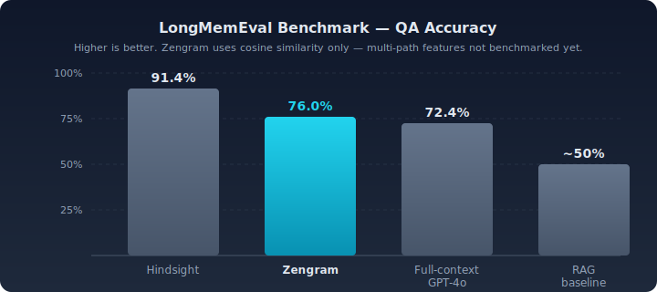

<p align="center">
  
  <h1 align="center">Zengram</h1>
  <p align="center">
    <strong>Shared memory for multi-agent AI systems.</strong>
  </p>
  <p align="center">
    <a href="#quick-start">Quick Start</a> &bull;
    <a href="#how-it-works">How It Works</a> &bull;
    <a href="#benchmarks">Benchmarks</a> &bull;
    <a href="#adapters--sdks">Adapters</a> &bull;
    <a href="docs/api-reference.md">API Docs</a> &bull;
    <a href="docs/configuration.md">Config</a>
  </p>
  <p align="center">
    <a href="https://github.com/ZenSystemAI/zengram/actions/workflows/ci.yml"></a>
    <a href="https://www.npmjs.com/package/@zensystemai/zengram-mcp"></a>
    
    
    
    
    <a href="https://github.com/ZenSystemAI/zengram/stargazers"></a>
  </p>
</p>

<p align="center">
  
</p>

Store a fact from Claude Code on your laptop, recall it from an autonomous agent on your server, get a briefing from n8n — all through the same memory system. Born from a production setup where nothing existed that let multiple AI agents share memory across separate machines.

---

## The Problem

<p align="center">
  
</p>

You run multiple AI agents — Claude Code for development, autonomous agents for tasks, n8n for automation. They each maintain their own context and forget everything between sessions. When one agent discovers something important, the others never learn about it.

## How It Works

### Typed Memory

<p align="center">
  
</p>

Events are immutable history. Facts upsert by key — new facts supersede old ones. Statuses track current state. Decisions record choices and reasoning. Each type has its own lifecycle, decay rules, and mutation semantics.

### Dual Storage

<p align="center">
  
</p>

Every memory lives in two places: **Qdrant** for semantic vector search and **SQLite/Postgres** for structured queries, entity graphs, and full-text BM25 search. Get both "find memories similar to X" and "give me all facts with key Y" from the same system.

### Multi-Path Search

Search runs three retrieval paths in parallel, fused with [Reciprocal Rank Fusion](https://plg.uwaterloo.ca/~gvcormac/cormacksigir09-rrf.pdf):

1. **Vector search** — Cosine similarity via Qdrant
2. **Keyword search** — BM25 via Postgres tsvector or SQLite FTS5
3. **Entity graph** — BFS traversal through relationship graph

Items found by multiple paths get boosted. **98.4% retrieval accuracy** on LongMemEval.

### Built for Multi-Agent

- **Cross-agent briefings** — "What happened since I was last here?" returns updates from all other agents
- **Agent-scoped API keys** — Each agent gets its own identity and permissions
- **Cross-agent corroboration** — Two agents storing the same fact = corroboration, not duplication
- **Credential scrubbing** — API keys, JWTs, passwords automatically redacted before storage
- **Entity extraction** — Regex + alias cache on every write, LLM refinement on consolidation
- **LLM consolidation** — Periodic background process merges duplicates, flags contradictions, discovers connections

## Benchmarks

<p align="center">
  
</p>

Evaluated on [LongMemEval](https://github.com/xiaowu0162/LongMemEval), the academic benchmark for long-term conversational memory:

| | Score |
|---|:---:|
| **Retrieval accuracy** (finding the right memories) | **98.4%** |
| **QA accuracy** (GPT-4o answering from retrieved context) | **76.0%** |
| Full-context GPT-4o (entire history in prompt, no retrieval) | 72.4% |

The benchmark uses **cosine similarity only** — none of the API's multi-path features (BM25, entity graph, temporal boost) were used. [Full methodology and per-category breakdown](docs/benchmarks.md).

> LongMemEval tests single-agent chat recall. Zengram is built for multi-agent coordination — features like cross-agent briefings, typed memory, entity graphs, and credential scrubbing aren't measured by this benchmark but are core to production use.

## How It Compares

| Feature | Zengram | [Mem0](https://github.com/mem0ai/mem0) | [Letta](https://github.com/letta-ai/letta) | [Zep](https://github.com/getzep/graphiti) | [Hindsight](https://github.com/cyanheads/hindsight-core) |
|---------|:-:|:-:|:-:|:-:|:-:|
| Cross-machine by design | **Yes** | Cloud only | No | Cloud only | No |
| Typed memory (event/fact/status/decision) | **Yes** | No | No | No | No |
| Multi-path search (vector+BM25+graph) | **Yes** | Vector only | Vector only | Hybrid | **Yes** |
| Cross-agent corroboration | **Yes** | No | No | No | No |
| Session briefings | **Yes** | No | No | No | No |
| Credential scrubbing | **Yes** | No | No | No | No |
| Entity extraction + linking | **Yes** | Graph (Pro) | No | **Yes** | No |
| LLM consolidation | **Yes** | Inline | Self-managed | No | Reflect |
| Temporal validity | **Yes** | No | No | **Yes** | No |
| MCP server included | **Yes** | Community | No | No | **Yes** |
| Self-hostable (fully open) | **Yes** | Community ed. | **Yes** | Graphiti only | **Yes** |

## Quick Start

```bash
git clone https://github.com/ZenSystemAI/zengram.git
cd zengram

cp .env.example .env
# Edit .env — set BRAIN_API_KEY and your embedding provider key

docker compose up -d

# Verify
curl http://localhost:8084/health

# Store your first memory
curl -X POST http://localhost:8084/memory \
  -H "Content-Type: application/json" \
  -H "X-Api-Key: YOUR_KEY" \
  -d '{
    "type": "fact",
    "content": "The API uses port 8084 by default",
    "source_agent": "my-agent",
    "key": "api-default-port"
  }'
```

## Adapters & SDKs

### MCP Server (Claude Code, Cursor, Windsurf)

14 tools: `brain_store`, `brain_search`, `brain_briefing`, `brain_query`, `brain_stats`, `brain_consolidate`, `brain_entities`, `brain_delete`, `brain_client`, `brain_export`, `brain_import`, `brain_graph`, `brain_reflect`, `brain_update`.

```json
{
  "mcpServers": {
    "zengram": {
      "command": "node",
      "args": ["/path/to/zengram/mcp-server/src/index.js"],
      "env": {
        "BRAIN_API_URL": "http://localhost:8084",
        "BRAIN_API_KEY": "your-key"
      }
    }
  }
}
```

Or install via npm: `npm install -g @zensystemai/zengram-mcp`

### Python SDK

```bash
pip install zengram
```

```python
from zengram import BrainClient

client = BrainClient("http://localhost:8084", api_key="your-key")
client.store(type="fact", content="Production DB is on db-prod-1", source_agent="devops", key="prod-db")
results = client.search("database configuration")
```

### Claude Code Skills

Copy [`adapters/claude-code/sessionend/`](adapters/claude-code/sessionend/) to your project's `.claude/skills/` to get the `/sessionend` ritual — structured session reflections stored directly to Zengram. [Full guide](adapters/claude-code/README.md).

### Bash CLI, n8n, OpenClaw

- **Bash**: `./adapters/bash/brain.sh store --type fact --content "Server migrated"`
- **n8n**: Import [`adapters/n8n/zengram-logger.json`](adapters/n8n/zengram-logger.json) for workflow logging
- **OpenClaw**: Drop [`adapters/openclaw/`](adapters/openclaw/) into your skills directory
- **Any HTTP client**: Plain REST — [full reference](docs/api-reference.md)

## Documentation

| Doc | Description |
|-----|-------------|
| [API Reference](docs/api-reference.md) | Every endpoint with request/response examples |
| [Architecture](docs/architecture.md) | System design, data flows, component inventory |
| [Configuration](docs/configuration.md) | All environment variables |
| [Data Model](docs/data-model.md) | Memory types, decay, dedup, supersedes logic |
| [MCP Tools](docs/mcp-tools.md) | The 14 MCP tools agents use |
| [Operations](docs/operations.md) | Deployment, monitoring, failure modes |
| [Benchmarks](docs/benchmarks.md) | Full LongMemEval methodology and results |
| [Examples](examples/) | curl demo, Python client, multi-agent scenario |

## Roadmap

**Recently shipped**: Web dashboard, Python SDK, SSE subscriptions, multi-collection support, on-demand LLM reflection, temporal validity, multi-path RRF search, entity graph visualization — [full changelog](CHANGELOG.md)

**Coming next**: Automatic memory capture, TypeScript SDK, hosted docs, LangChain/LlamaIndex integration

## Contributing

Contributions welcome! See [CONTRIBUTING.md](CONTRIBUTING.md).

## See Also

- **[OpenClaw Memory Toolkit](https://github.com/ZenSystemAI/openclaw-memory)** — Long-term memory for OpenClaw agents, with an optional bridge back to Zengram.

## License

MIT — see [LICENSE](LICENSE).

---

<p align="center">
  Built by <a href="https://github.com/ZenSystemAI">ZenSystem AI</a>
</p>
