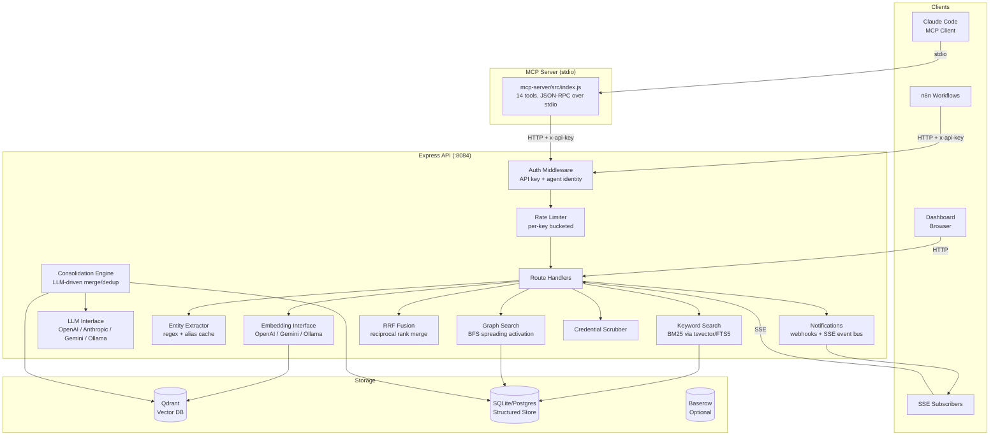
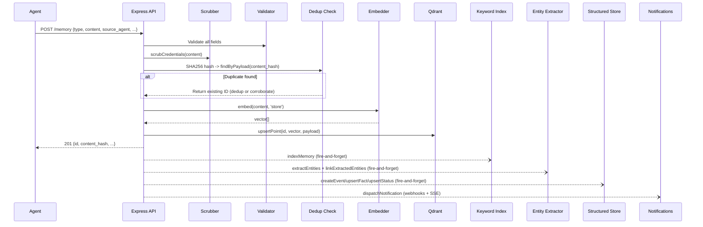
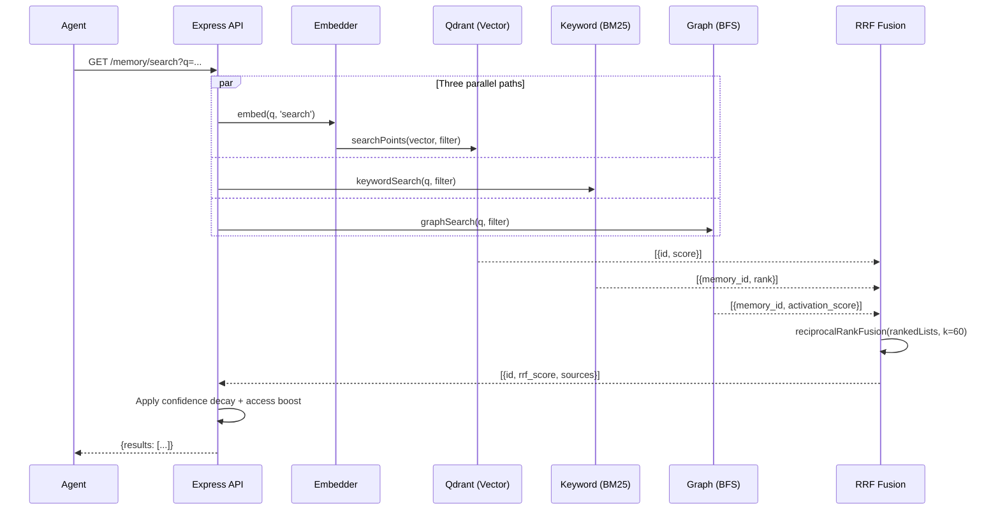
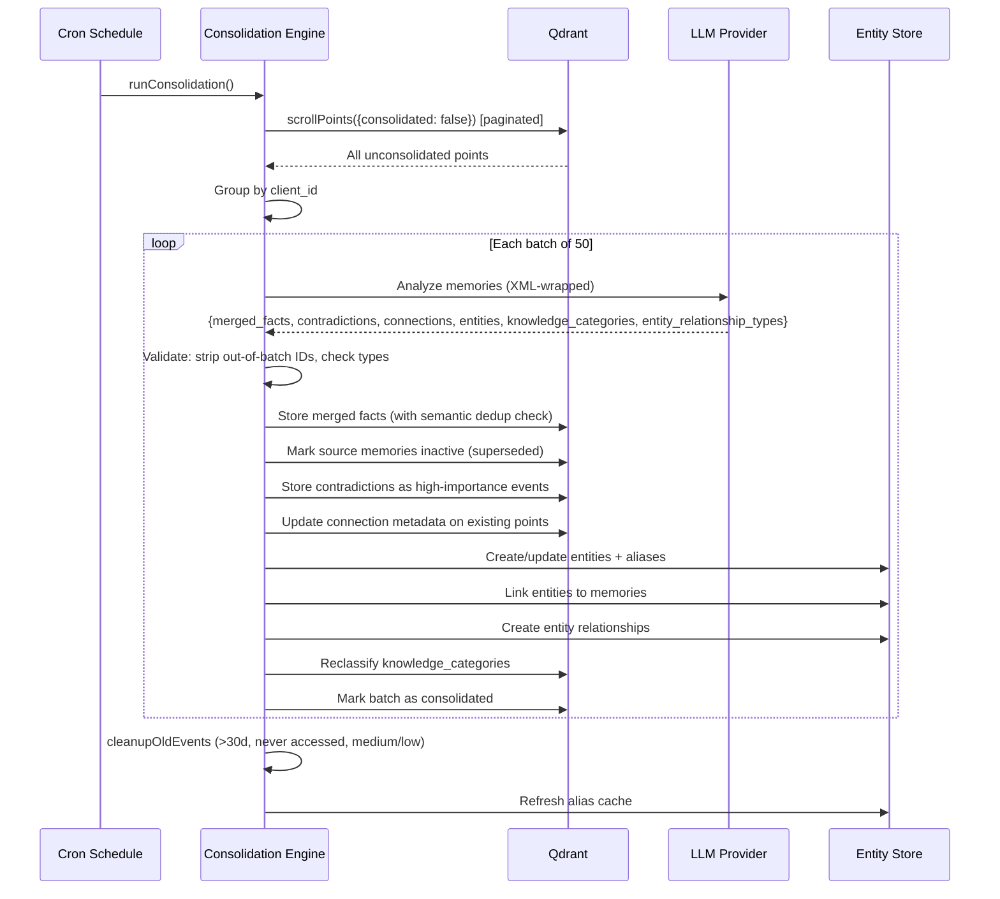

# System Architecture

Zengram is a multi-agent memory system that enables AI agents (Claude Code, n8n, Morpheus, etc.) to share persistent knowledge through a unified API. Memories are stored as vectors in Qdrant, indexed for full-text search, linked through an entity graph, and consolidated by an LLM on a schedule.

## High-Level Architecture

## Startup Sequence

Defined in `api/src/index.js`:

1. **Validate environment** -- `BRAIN_API_KEY` required or fatal exit
2. **Initialize embedding provider** -- OpenAI, Gemini, or Ollama (test embed validates connectivity)
3. **Initialize Qdrant** -- Create `shared_memories` collection if missing, ensure all payload indexes
4. **Initialize structured store** -- SQLite (default), Postgres, Baserow, or none
5. **Initialize keyword search** -- BM25 via Postgres `tsvector` or SQLite FTS5
6. **Initialize client resolver** -- Loads client fingerprints from Baserow for fuzzy matching
7. **Load entity alias cache** -- Pre-populates in-memory alias map from structured store + built-in tech dict
8. **Initialize consolidation LLM** (if enabled) -- Sets up cron schedule (default: every 6 hours)
9. **Start Express server** -- Binds to `HOST:PORT` (default `127.0.0.1:8084`)
10. **Register graceful shutdown** -- SIGTERM/SIGINT handlers with 10s forced exit timeout

## Component Inventory

### Routes (`api/src/routes/`)

| File | Mount | Purpose |
|------|-------|---------|
| `memory.js` | `/memory` | Store, search (multi-path), query, update, delete memories |
| `briefing.js` | `/briefing` | Session briefings: what happened since timestamp |
| `stats.js` | `/stats` | Memory health dashboard: counts, decay, retrieval status |
| `entities.js` | `/entities` | Entity CRUD, reclassification, heuristic suggestions |
| `graph.js` | `/graph` | Entity graph JSON + interactive D3.js HTML visualization |
| `client.js` | `/client` | Client briefings by knowledge category, fuzzy name resolution |
| `export.js` | `/export` | Export/import memories as JSON (backup/migration) |
| `consolidation.js` | `/consolidate` | Trigger consolidation, poll jobs, check status |
| `webhook.js` | `/webhook` | Structured n8n webhook ingestion |
| `reflect.js` | `/reflect` | LLM-powered topic synthesis across memories |
| `subscribe.js` | `/subscribe` | SSE real-time event stream |
| `dashboard.js` | `/dashboard` | Serves HTML dashboard (no auth required) |

### Services (`api/src/services/`)

| File | Purpose |
|------|---------|
| `qdrant.js` | Qdrant HTTP client: upsert, search, scroll, batch ops, decay computation |
| `consolidation.js` | LLM consolidation pipeline: merge, contradictions, entities, relationships |
| `entities.js` | Regex + alias-cache entity extraction, reclassification, linking |
| `rrf.js` | Reciprocal Rank Fusion: merges vector + keyword + graph result lists |
| `keyword-search.js` | BM25 full-text search via Postgres tsvector or SQLite FTS5 |
| `graph-search.js` | BFS spreading activation through entity relationship graph |
| `notifications.js` | Webhook dispatch + SSE event bus emission |
| `event-bus.js` | In-process EventEmitter for SSE subscribers (max 50) |
| `scrub.js` | Credential scrubbing from memory content |
| `client-resolver.js` | Fuzzy client name resolution from Baserow fingerprints |
| `fetch-with-timeout.js` | Fetch wrapper with configurable timeout |
| `entity-type-heuristics.js` | Auto-detect misclassified entities via pattern rules |

### Embedding Providers (`api/src/services/embedders/`)

| File | Provider | Model/Dims |
|------|----------|------------|
| `interface.js` | Router | Selects provider by `EMBEDDING_PROVIDER` env var |
| `openai.js` | OpenAI | `text-embedding-3-small` (1536 dims) |
| `gemini.js` | Gemini | `gemini-embedding-2-preview` (3072 dims, Matryoshka) |
| `ollama.js` | Ollama | Auto-detected from model (e.g. `nomic-embed-text`) |

Gemini uses task-specific embeddings: `RETRIEVAL_DOCUMENT` for storage, `RETRIEVAL_QUERY` for search.

### LLM Providers (`api/src/services/llm/`)

| File | Provider | Used For |
|------|----------|----------|
| `interface.js` | Router | Selects by `CONSOLIDATION_LLM` env var |
| `openai.js` | OpenAI | Consolidation + reflection (default: `gpt-4o-mini`) |
| `anthropic.js` | Anthropic | Consolidation + reflection |
| `gemini.js` | Gemini | Consolidation + reflection |
| `ollama.js` | Ollama | Consolidation + reflection (local) |

### Structured Store Backends (`api/src/services/stores/`)

| File | Backend | Features |
|------|---------|----------|
| `interface.js` | Router | Selects by `STRUCTURED_STORE` env var |
| `sqlite.js` | SQLite | Default. Events, facts, statuses, entities, aliases, relationships, FTS5 |
| `postgres.js` | Postgres | Production. Same tables + tsvector GIN index for full BM25 |
| `baserow.js` | Baserow | Limited: events, facts, statuses only (no entity store) |

### Middleware (`api/src/middleware/`)

| File | Purpose |
|------|---------|
| `auth.js` | API key auth: admin key (full access) or agent-scoped keys (identity-bound) |
| `ratelimit.js` | Per-key bucketed rate limiting: writes 60/min, reads 120/min, consolidation 1/hr |
| `validate.js` | Input validation: type, content (max 10K chars), agent names, metadata depth |

### MCP Server (`mcp-server/src/`)

| File | Purpose |
|------|---------|
| `index.js` | MCP server with 14 tools, stdio transport, wraps API calls with timeouts |

## Data Flow: Store Path

Key behaviors:
- **Deduplication** is tenant-scoped: checks `content_hash` + `client_id` + `type` + `active=true`
- **Same agent duplicate**: returns existing memory ID silently
- **Different agent duplicate**: records cross-agent corroboration (bumps `observed_by` list, capped at 20)
- **Supersedes logic**: facts with matching `key` or statuses with matching `subject` deactivate the old version
- **Entity extraction** is LLM-free: uses regex patterns, known tech dictionary (70+ entries), capitalized phrase detection, and an alias cache

## Data Flow: Search Path (Multi-Path Retrieval)

The three retrieval paths run in parallel:
1. **Vector search** (Qdrant cosine similarity, score threshold 0.3)
2. **Keyword search** (BM25 via Postgres `ts_rank_cd` or SQLite FTS5 `MATCH`)
3. **Graph search** (extract entities from query, BFS through relationship graph, collect linked memory IDs)

Results are fused using **Reciprocal Rank Fusion**: `score(d) = sum(1 / (k + rank))` where k=60 (configurable via `RRF_K`).

## Data Flow: Consolidation Path

## Qdrant Collection Schema

Collection: `shared_memories`

| Field | Index Type | Purpose |
|-------|-----------|---------|
| `type` | Keyword | Filter by memory type (event/fact/decision/status) |
| `source_agent` | Keyword | Filter by originating agent |
| `client_id` | Keyword | Tenant isolation |
| `category` | Keyword | semantic/episodic/procedural |
| `importance` | Keyword | critical/high/medium/low |
| `content_hash` | Keyword | SHA256 truncated to 16 chars, for dedup lookups |
| `key` | Keyword | Fact upsert key (supersedes matching) |
| `subject` | Keyword | Status subject (supersedes matching) |
| `knowledge_category` | Keyword | brand/strategy/meeting/content/technical/relationship/general |
| `active` | Bool | Soft-delete filter (true = visible in search) |
| `confidence` | Float | Base confidence (used with decay) |
| `access_count` | Integer | How often this memory has been retrieved |
| `created_at` | Datetime | Creation timestamp |
| `last_accessed_at` | Datetime | Last retrieval timestamp (for decay) |
| `entities[].name` | Keyword (nested) | Entity name filter for entity-scoped search |

Vector config: Cosine distance, dimensions set dynamically from embedding provider. Indexing threshold: 100.

## Structured Store Tables

Tables created by SQLite/Postgres backends:

| Table | Columns | Purpose |
|-------|---------|---------|
| `events` | id, content, type, source_agent, client_id, category, importance, knowledge_category, content_hash, created_at | Append-only event log |
| `facts` | id, key, value, source_agent, client_id, category, importance, created_at, updated_at | Upsertable facts by key |
| `statuses` | id, subject, status, source_agent, client_id, category, created_at, updated_at | Current state by subject |
| `entities` | id, canonical_name, entity_type, first_seen, last_seen, mention_count | Knowledge graph nodes |
| `entity_aliases` | id, entity_id, alias | Alternative names for entities |
| `entity_memory_links` | id, entity_id, memory_id, role, linked_at | Entity-to-memory edges |
| `entity_relationships` | id, source_entity_id, target_entity_id, relationship_type, strength, first_seen, last_seen | Entity-to-entity edges |
| `memory_search` (Postgres) | memory_id, content, content_tsv, client_id, source_agent, type, active | BM25 full-text with GIN index |
| `memory_search_fts` (SQLite) | memory_id, content, client_id, type | FTS5 virtual table |

## Docker Deployment

Defined in `docker-compose.yml`:

| Container | Image | Ports | Volumes |
|-----------|-------|-------|---------|
| `zengram-qdrant` | `qdrant/qdrant:latest` | 6334:6333 (HTTP), 6335:6334 (gRPC) | `./data/qdrant` |
| `zengram-api` | Built from `./api` | 8084:8084 | `./data` |
| `zengram-postgres` (optional, `postgres` profile) | `postgres:16-alpine` | 5433:5432 | `./data/postgres` |

All ports bind to `127.0.0.1` by default for security. Set `API_BIND=0.0.0.0` for LAN access.

## Cross-References

- [Operations Runbook](operations.md) -- deployment, monitoring, failure modes
- [API Reference](api-reference.md) -- every endpoint with request/response schemas
- [Data Model](data-model.md) -- memory types, decay, dedup, supersedes logic
- [MCP Tools](mcp-tools.md) -- the 14 MCP tools agents use
- [Configuration](configuration.md) -- every environment variable
